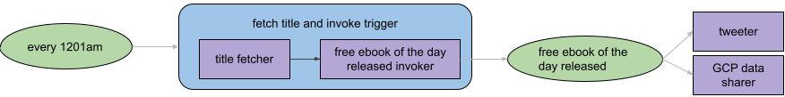

# packt-book-bot

[](https://github.com/mattwelke/packt-book-bot/actions/workflows/codeql-analysis.yml)
[](https://github.com/mattwelke/packt-book-bot/actions/workflows/build_and_deploy.yml)

Bot that tweets (https://twitter.com/PacktBookBot) and logs the Packt free eBook of the day in BigQuery daily.

## Features

### Free eBook of the day - every day at 12:01am UTC
  
#### Tweeted from Twitter bot


#### Logged in a public BigQuery table on GCP (Google Cloud Platform)

```sql
SELECT day, title, authors_v2 AS authors
FROM `packt-book-bot.public_data.free_ebook_of_the_day`
ORDER BY day DESC
```


Any user authenticated to GCP is able to view this table's schema and query it because of its dataset's IAM configuration:


## Tech stack & architecture

Written using Java 16, deployed to IBM Cloud Functions using the custom Java 17 runtime from https://github.com/ow-extended-runtimes/java-17.

Uses a periodic trigger to begin processing at 12:01am every day. Uses a custom trigger to decouple the data retrieval from use cases for the data. This enables multiple use cases for the fetched data such as tweeting from a Twitter bot and building a public BigQuery dataset on GCP. In the future, this might include publishing to a GCP Pub/Sub topic too.

Separate OpenWhisk actions run to accomplish each use case:

### title fetcher

Java action that scrapes the packtpub.com site to get which title is the free eBook of the day, as well additional info useful for logging, like publication date and author(s). It tries to perform more web scraping with Google to find the product page URL, but emits the event whether it's able to do so or not. The "productPageUrl" property in the emitted event is optional. Consumers of the events must check whether it's present before trying to use it.

Source code located in `title-fetcher` directory.

### free ebook of the day invoker

Simple JavaScript action based on README in https://github.com/apache/openwhisk-client-js. 
Serves as "glue" to trigger a custom event representing an eBook of the day being released. Used in an OpenWhisk sequence with the title fetcher action.

This exists in the architecture as a separate action only because there is no official Java client for OpenWhisk right now. If a Java client existed, it would be simpler to not have this action (and therefore, not have a sequence containing this action and the title fetcher action) and just have the title fetcher action trigger the event after fetching the title data.

Source code, which is not present in this repo:

```javascript
var openwhisk = require('openwhisk');

async function main(params) {
    const triggerName = 'free-ebook-of-the-day-released';
    
    try {
        var ow = openwhisk();
        const triggerResult = await ow.triggers.invoke({
            name: triggerName,
            params,
        });
        console.info(`invoked trigger "${triggerName}"`, triggerResult);
        return {};
    } catch (err) {
        console.error(`failed to invoke trigger "${triggerName}"`, err);
        return {};
    }
}
```

### tweeter

Java action that, upon a free eBook of the day being released, tweets a message about the title. It checks whether the data from the event includes the product page URL. If so, it includes it in a "detailed" tweet. Because the detailed tweets include the product page URL, they're rendered nicer by Twitter than tweets that only have the free learning URL. If the event doesn't have the product page URL, this action uses a "minimal" tweet designed to at least point the Twitter user to the page they can visit to download the free book, even if the Tweet is rendered kind of ugly.

Source code located in `tweeter` directory.

### GCP data sharer

Java action that, upon a free eBook of the day being released, uses the BigQuery streaming API to insert a row into a BigQuery table in a public dataset.

Source code located in `gcp-data-sharer` directory.

### Diagram

Legend:

* Green oval = trigger
* Blue rounded rectangle = sequence
* Purple rectangle = action



**Why Java?**

* I prefer working with compiled programming langauges and I wanted to practice my Java.
* Despite starting up slower than other programming languages supported by OpenWhisk, because this use case is for background processing (no user waits for it to complete), this isn't an issue.

**Why Java 16?**

Despite deploying to a Java 17 runtime, because GitHub's CodeQL only works with up to Java 16 right now, the action code is Java 16.

**Why IBM Cloud?**

* They have a good free tier for FaaS functions.
  * This includes invocations.
  * This also includes periodic scheduled events to trigger them ([OpenWhisk alarms](https://github.com/apache/openwhisk-package-alarms/blob/master/provider/lib/cronAlarm.js)).
* Their FaaS service is powered by the open source FaaS project [Apache OpenWhisk](https://openwhisk.apache.org/)! 

**Why BigQuery?**

* Good for both huge and tiny datasets. Tiny datasets fit within their free tier.
* Easy to share data publicly via GCP IAM for BigQuery (https://cloud.google.com/bigquery/public-data).

**Why multi cloud?**

Using the best tool for the job.

* IBM Cloud has a better free tier for event based FaaS (GCP's Cloud Scheduler has a max number of jobs in the free tier).
* Google Cloud has a better free tier for exposing data publicly so that it can be queried with SQL.
  * IBM Cloud has SQL Query which is similar to GCP's BigQuery in that you can query data with SQL, including public data, but it charges based on the number of cloud object storage object reads. This would add up quickly for this use case. BigQuery only charges per data scanned, which is better for this use case.
  * People who want to use this data are more likely to be familiar with GCP than IBM Cloud.
